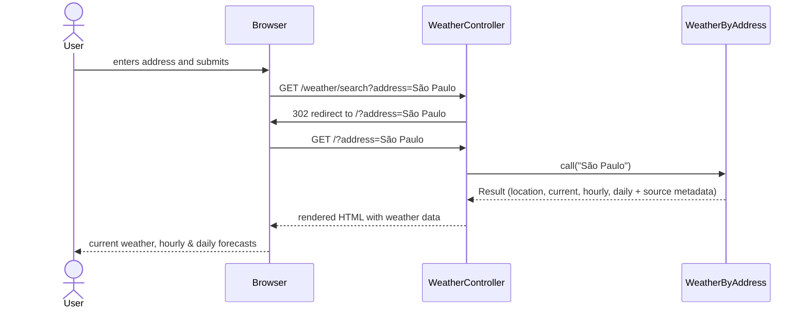
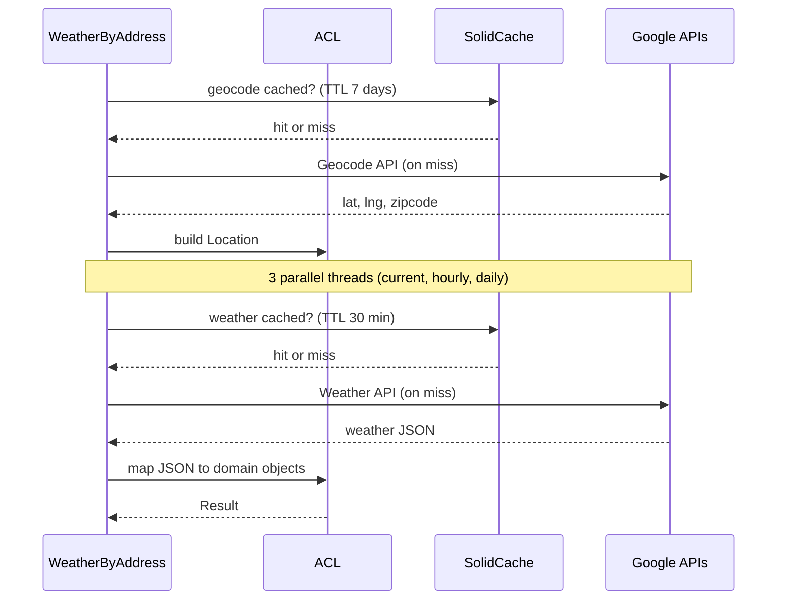

# Weather App

A weather forecast application built with Ruby on Rails. Search any address or
zip code to view current conditions, an hourly forecast (6 hours), and a daily
forecast (7 days) — all powered by the Google Weather and Geocode APIs.

## Documentation

Access the hosted documentation at
[pablowillians.github.io/weather-app](https://pablowillians.github.io/weather-app/).

Generate it locally with `bin/doc` (opens in the browser automatically).

## Features

- Search by address, city name, or zip code.
- Current weather: temperature, feels-like, condition description, and icon.
- Hourly forecast for the next 6 hours.
- Daily forecast for the next 7 days (or less if the API returns less than 7 days) with temperature range bars.
- Transparent cache-vs-API badge on every data section.
- Geocode caching (7 days) and weather caching (30 minutes).

## Architecture

The application follows a **layered service architecture** inspired by DDD
(Domain-Driven Design). All business logic lives under `app/services/`:

```
app/services/
├── application/               # Use-case orchestration
│   └── weather_by_address/    # Geocode → fetch → map → Result
│       ├── acl.rb             # Anti-Corruption Layer (API → domain)
│       └── result.rb          # Immutable result wrapper
├── domains/                   # Pure value objects, no dependencies
│   ├── geocode/
│   │   └── location.rb
│   └── weather/
│       ├── current_weather.rb
│       ├── daily_forecast_entry.rb
│       ├── hourly_forecast_entry.rb
│       ├── weather_at_location.rb     # Aggregate root
│       └── weather_condition.rb
└── infrastructure/            # External API adapters
    └── adapters/
        ├── geocode/           # Google Geocode API
        └── weather/           # Google Weather API (current, hourly, daily)
```

### Request flow — Presentation layer

From the user's search to the rendered page. The application service is
treated as a black box here (details in the next diagram).



### Request flow — Application service

What happens inside `WeatherByAddress#call`: geocoding, parallel weather
fetching, caching, and domain mapping.



## Technologies

- Ruby 3.4.5
- Ruby on Rails 8.1.2
- SQLite3 (via SolidCache)
- Tailwind CSS (CDN)
- RSpec 8.0 + Minitest (system tests)
- Capybara + Selenium (headless Chrome)
- RDoc for documentation
- Docker

## Setup

### Prerequisites

#### Obligatory

- A [Google Cloud](https://console.cloud.google.com/google/maps-apis/credentials)
  API key with the **Geocoding API** and **Weather API** enabled.

#### Option 1 (Recommended)

- Docker + Docker Compose

#### Option 2 (Alternative)

- Ruby 3.4.5 (managed via `.ruby-version`)
- Bundler

### Required steps

1. Clone the repository:

```bash
git clone https://github.com/pablowillians/weather-app.git
cd weather-app
```

2. Copy the environment file and add your API key:

```bash
cp .env.example .env
# Edit .env and set GOOGLE_PLACES_API_KEY=your_key_here
```

### Running with Docker Compose

1. Build and start the container:

```bash
docker compose up --build
```

### Running without Docker Compose

1. Install dependencies and prepare the database:

```bash
bin/setup
```

2. Start the development server:

```bash
bin/dev
```

### Accessing the application

```bash
http://localhost:3000
```

## Running Tests

### RSpec (unit, integration, request)

```bash
bundle exec rspec
```

### Minitest system tests (browser)

```bash
bin/rails test:system
```

## Generating Documentation

```bash
bin/doc
```

This runs RDoc over the README, controllers, helpers, and services, then opens
the generated site in the browser. The same docs are deployed to GitHub Pages on
push to `main`.

## Decisions

### Geocode cache with a 7-day TTL

Geographic coordinates for a given address change extremely rarely — a street
address will resolve to the same latitude/longitude for years. By caching the
geocode response for 7 days we avoid a redundant API call on every request for
the same address, reducing latency and cutting costs while still allowing
eventual updates if Google refines its data.

### Caching the full API response

The cache stores the entire JSON payload returned by each Google API, not just
the fields the UI currently uses. This means new UI features (e.g. wind speed,
wind direction, humidity) can read from the same cached response without
requiring a cache flush or migration — the data is already there.

The trade-off is storing more data than strictly necessary today, which could be
seen as premature optimisation. This was accepted because (1) the payloads are
small (a few KB each), (2) it guarantees consistency between cached and live
responses — both always carry the same shape and fields, so switching between
sources never causes missing-data bugs — and (3) it avoids coupling the cache
schema to the current UI, making the system easier to evolve.

### Weather cache keyed by zipcode or coordinates

Weather adapter cache keys use the zipcode when available, falling back to
latitude/longitude. This maximises cache hits because different search terms
often resolve to the same location: "New York City" and "New York, New York"
both geocode to the same coordinates, and distinct street numbers on the same
street share the same zipcode. By keying on zipcode (or coordinates as a
fallback), all those variations reuse a single cached weather response instead
of fetching from the API separately.

## Future improvements

- **Address autocomplete.** Integrating the Google Places Autocomplete API
  would let users pick a standardised address from a dropdown. This has two
  benefits: (1) consistent cache keys, since every user selects the same
  canonical address string instead of typing free-form variations, and
  (2) the autocomplete response already contains the location coordinates,
  which would eliminate the geocode API call entirely — even on the very first
  search for that address.

- **WebSockets for partial updates.** Currently every search triggers a full
  page reload. Using Action Cable (WebSockets) the server could push weather
  data to the browser as each parallel fetch completes, updating the current
  conditions, hourly forecast, and daily forecast sections independently.
  Combined with autocomplete, this would also allow instant UI feedback while
  the address is being typed, without round-tripping through a form
  submission.
